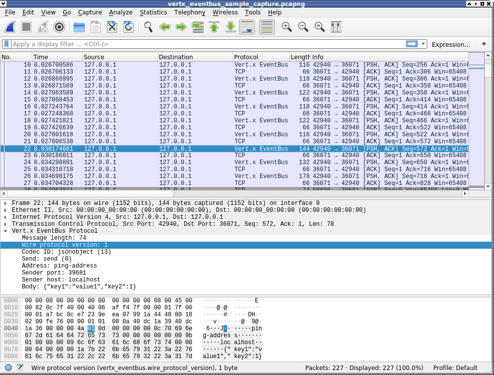

# Vert.x EventBus Wireshark Dissector

## Overview

The [vertx_eventbus_dissector.lua](vertx_eventbus_dissector.lua) script allows you to analyze Vert.x EventBus communication protocol in Wireshark.
This is the protocol used by Vert.x nodes that communicate over EventBus in clustered mode. See the script for more information on how to use it in Wireshark.

## Sample Capture File

You can use [this](vertx_eventbus_sample_capture.pcapng) Vert.x EventBus capture file to check the dissector out.

## Screenshot

